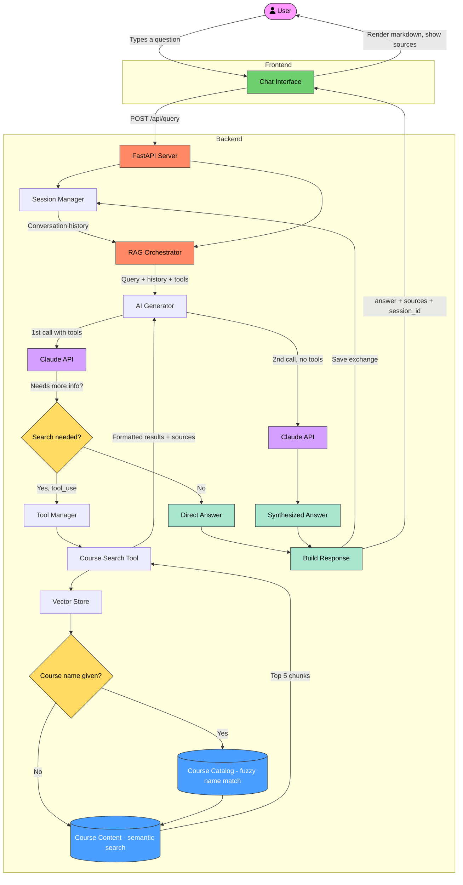

# Request Flow

```mermaid
graph TD
    User([fa:fa-user User]) -->|Types a question| UI

    subgraph Frontend
        UI[Chat Interface]
    end

    UI -->|POST /api/query| API

    subgraph Backend
        API[FastAPI Server]
        API --> Sessions[Session Manager]
        Sessions -->|Conversation history| RAG

        API --> RAG[RAG Orchestrator]

        RAG -->|Query + history + tools| LLM[AI Generator]

        LLM -->|1st call with tools| Claude[Claude API]

        Claude -->|Needs more info?| Decision{Search needed?}

        Decision -->|No| DirectAnswer[Direct Answer]
        Decision -->|Yes, tool_use| ToolExec[Tool Manager]

        ToolExec --> SearchTool[Course Search Tool]

        SearchTool --> VS[Vector Store]

        VS --> Resolve{Course name given?}
        Resolve -->|Yes| Catalog[(Course Catalog - fuzzy name match)]
        Resolve -->|No| Content
        Catalog --> Content[(Course Content - semantic search)]

        Content -->|Top 5 chunks| SearchTool
        SearchTool -->|Formatted results + sources| LLM
        LLM -->|2nd call, no tools| Claude2[Claude API]
        Claude2 --> FinalAnswer[Synthesized Answer]

        DirectAnswer --> Response
        FinalAnswer --> Response[Build Response]
        Response -->|Save exchange| Sessions
    end

    Response -->|answer + sources + session_id| UI
    UI -->|Render markdown, show sources| User

    style User fill:#f9f,stroke:#333,color:#000
    style Claude fill:#d4a0ff,stroke:#333,color:#000
    style Claude2 fill:#d4a0ff,stroke:#333,color:#000
    style Catalog fill:#4a9eff,stroke:#333,color:#fff
    style Content fill:#4a9eff,stroke:#333,color:#fff
    style Decision fill:#ffda63,stroke:#333,color:#000
    style Resolve fill:#ffda63,stroke:#333,color:#000
    style UI fill:#6ecf6e,stroke:#333,color:#000
    style API fill:#ff8a65,stroke:#333,color:#000
    style RAG fill:#ff8a65,stroke:#333,color:#000
    style DirectAnswer fill:#a8e6cf,stroke:#333,color:#000
    style FinalAnswer fill:#a8e6cf,stroke:#333,color:#000
    style Response fill:#a8e6cf,stroke:#333,color:#000
```
